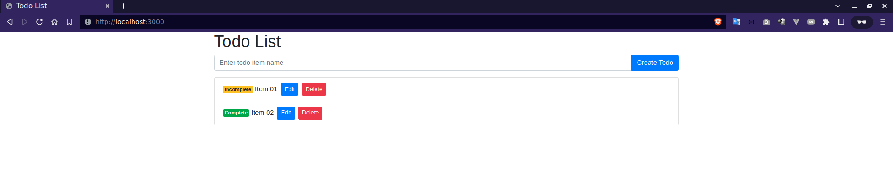
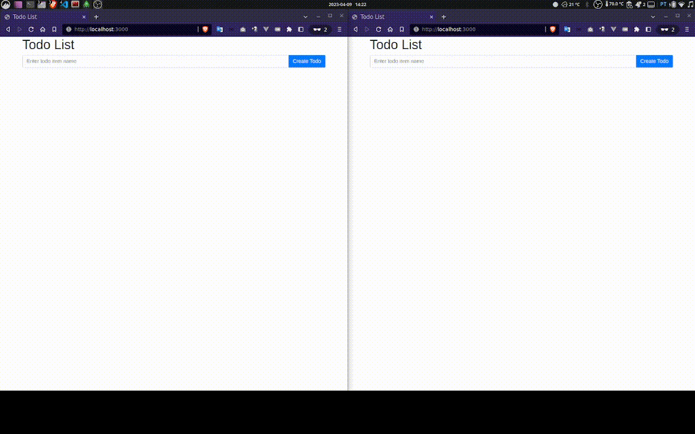

# Simple Todo List App with Node.js, Express, Mongoose, Socket.io, Bootstrap 4.5 and EJS
This is a simple Todo List application built with Node.js, Express, Mongoose, Socket.io, Bootstrap 4.5, and EJS. The app allows users to create, read, update, and delete tasks, and updates the page in real-time using Socket.io.

## How it works
The app allows users to create, read, update, and delete tasks. When a task is created, updated, or deleted, an event is emitted via Mongodb that emits an Socket.io event and sent it to the frontend

## Prerequisites
Before you can run this app, you'll need to have the following installed on your machine:

* Docker
* Docker-compose

## Installation
```sh
# Clone this repository
git clone https://github.com/stdioh321/nw-pdi-2023.git
# Navigate to the project directory
cd nw-pdi-2023/event-stream
```

## Usage
To run the app, run the following command:

```sh
# Run docker-compose
docker-compose up
```
This should start the application at: http://localhost:3000


Using the interface, create, update or delete tasks

### Realtime-update
Open 2 or more pages at http://localhost:3000 and create, update or delete tasks

It should update all the pages in realtime

## Technologies Used
### Backend
* Node.js
* Express
* Mongoose
* Socket.io

### Frontend
* Bootstrap 4.5
* EJS
* Socket.io-client