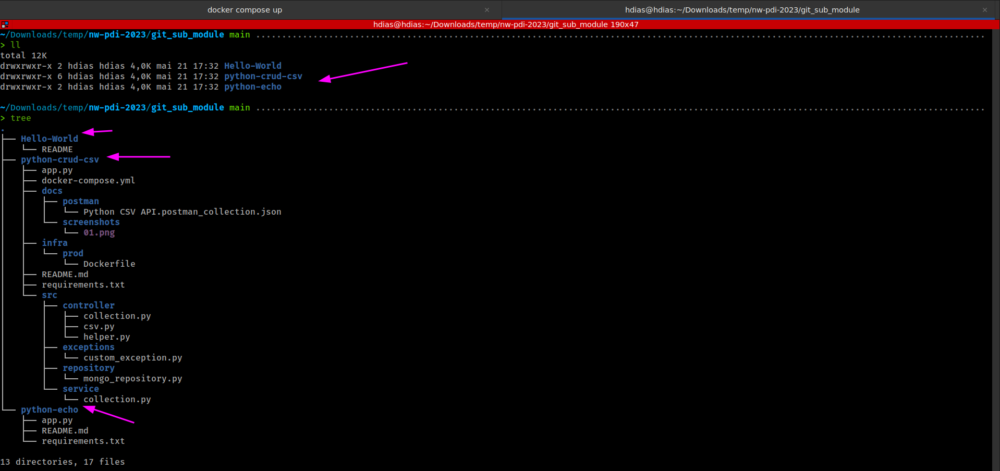

# Git Submodule Practice
This repository is created for practicing git submodules. It contains a folder called `git_sub_module` which consists of three submodules.

## Requirements
1. git

## Setup
To get started, follow these steps:

```sh
git clone https://github.com/stdioh321/nw-pdi-2023.git
cd nw-pdi-2023
```

## Usage
To initialize and update the submodules, run the following commands:
```sh
git submodule init
git submodule update
```

After running the commands above, navigate to the `git_sub_module` folder. You should see three folders corresponding to the git repositories.

