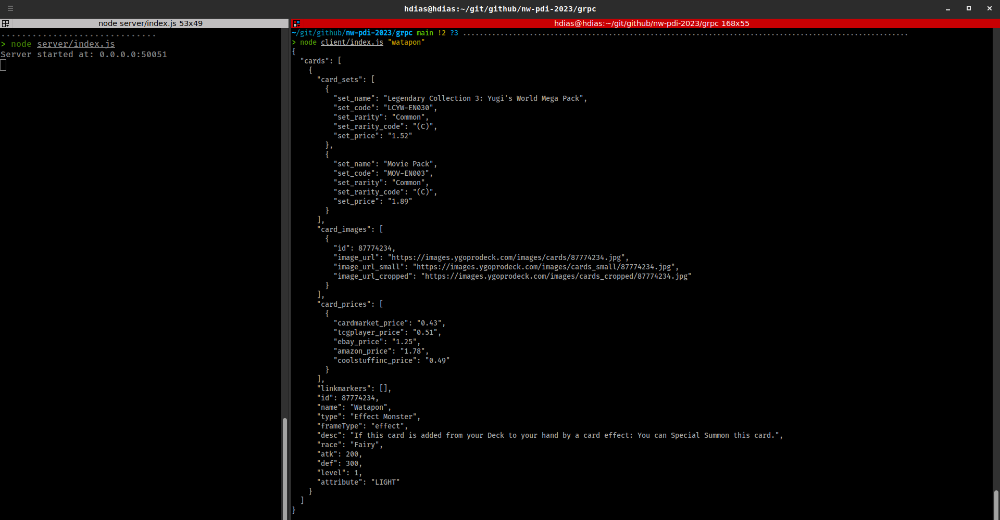

# Testing GRRP
Using nodejs + grpc to query all available yugioh cards via api

# Requirements
1. [Node 14](https://nodejs.org/en)

# Setup
### Server
```sh
cd server
npm install -f
```
### Client
```sh
cd client
npm install -f
```

# RUN
```sh
# Start server
node server/index.js
# Make a query with the client
# node client/index.js "[CARD_NAME]"
node client/index.js "Dark magician"
```
| Terminal                             |
| :----------------------------------- |
|  |

# References
* https://ygoprodeck.com/api-guide/