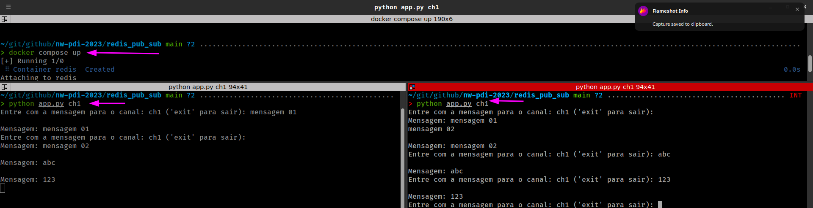

# Python Redis Pub/Sub Application
Este é um aplicativo Python que demonstra o uso do sistema de mensagens Redis Pub/Sub. Ele permite que várias instâncias do aplicativo se inscrevam em um canal específico e recebam mensagens em tempo real. O aplicativo é conteinerizado usando o Docker Compose para facilitar a implantação e o gerenciamento.

## Pré-requisitos
Antes de executar o aplicativo, certifique-se de ter os seguintes pré-requisitos instalados:
1. Python (versão 3.6 ou superior)
2. Docker
3. Docker compose

## Setup
1. Para começar a usar o aplicativo, siga as etapas abaixo:

```sh
git clone https://github.com/stdioh321/nw-pdi-2023.git
cd nw-pdi-2023/redis_pub_sub
```
2. Instale as dependências necessárias:
```sh
pip install -r requisitos.txt
```

## RUN
1. Inicie o servidor Redis usando o Docker Compose:
```sh
docker-compose up
```

2. Abra várias novas janelas de terminal e execute o seguinte comando para enviar mensagens:

```sh
# Substitua <nome_do_canal> pelo nome desejado do canal no qual você deseja publicar mensagens.
python app.py <nome_do_canal>
```

3. Digite as mensagens no terminal e pressione Enter para publicá-las no canal especificado.
   

4. Observe como todas as instâncias em execução do aplicativo recebem as mensagens em tempo real.

5. Para parar o aplicativo, pressione Ctrl+C ou 'quit' no terminal onde você iniciou o Docker Compose.