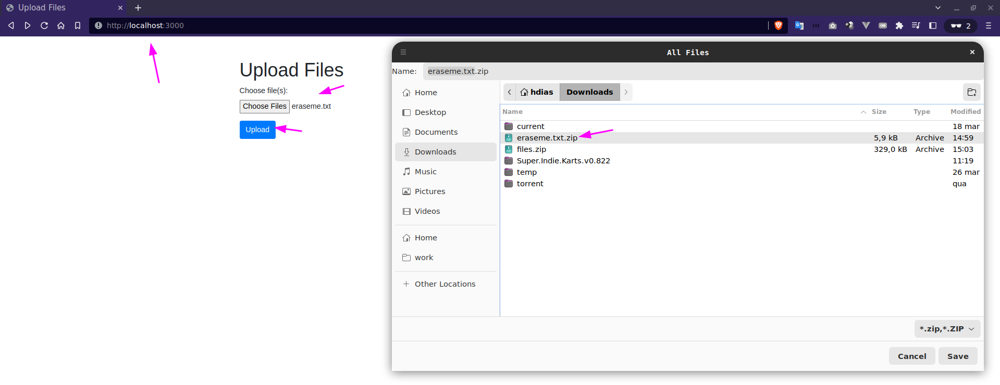

# Upload files and return as zip

# Getting Started
## Prerequisites
* Node.js (v14 or higher)
* npm (v6 or higher)

## Installation
1. Clone this repository
```sh
git clone https://github.com/stdioh321/nw-pdi-2023.git
cd stream
```
2. Install dependencies
```sh
npm install -f
```
3. Start server
```sh
npm run start
```
> It should start server at: http://localhost:3000

# Usage
1. Open the web interface at http://localhost:3000
2. Select one or multiple files to upload.
3. Click the "Upload" button.
4. The server will respond with a zipped file containing the uploaded files.


# Built With
* [Express](https://expressjs.com/) - Web framework for Node.js
* [Multer](https://github.com/expressjs/multer) - Middleware for handling multipart/form-data
* [Archives](https://github.com/archiverjs/node-archiver) - Library for creating and manipulating archives
* [dotenv](https://github.com/motdotla/dotenv) - Zero-dependency module that loads environment variables